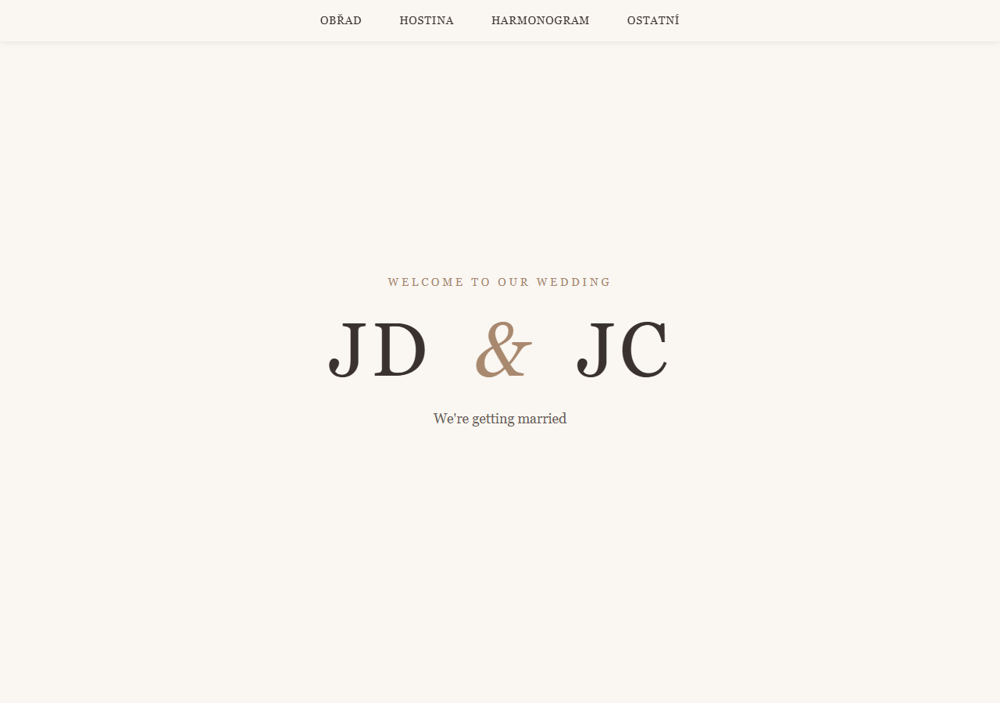

# svatbaweb

Wedding website for JD & JC — a static multi-page HTML/CSS site.

## Pages

- `index.html` — landing page
- `obrad.html` — ceremony (place & time, directions, parking)
- `hostina.html` — reception (place & time, accommodation, parking)
- `harmonogram.html` — schedule
- `ostatni.html` — other information

## Preview



## Development

Styles live in `src/styles/style.css`. TypeScript sources (if any) are compiled with:

```bash
npm run build
```

No dev server is required — open any `.html` file directly in a browser.
